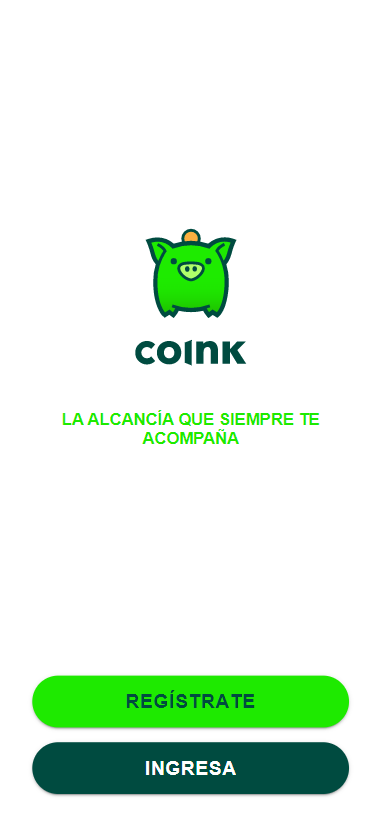
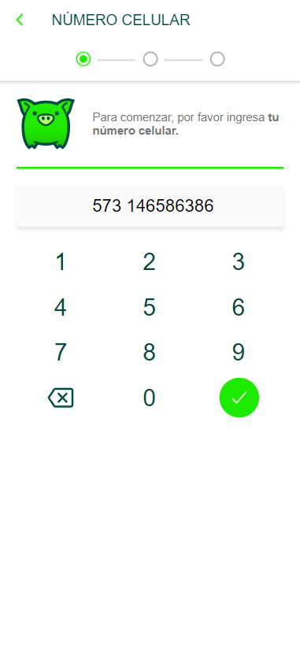
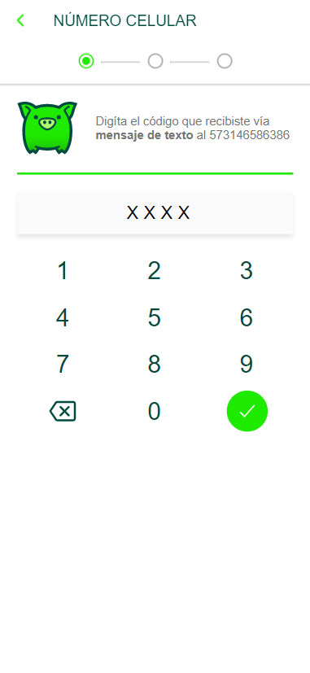
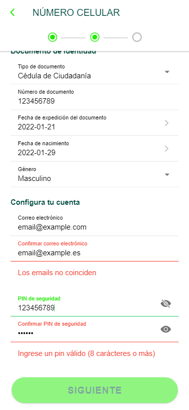
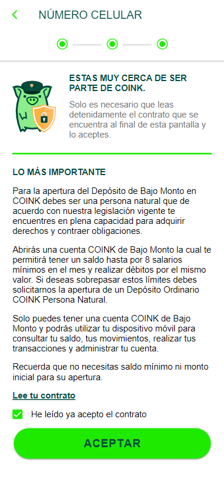
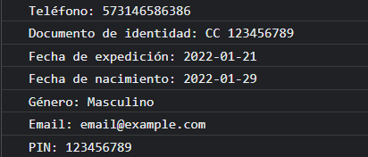

# Coink

This is an aplications that simulates the register process of the users in the [`Coink platform`](https://coink.com/), this app doesn't register users in a database, it is just a preview.

## Installation

To run this app, you have to make sure `npm` and `ionic` are installed
```bash
ionic -v
npm -v
```

If `npm` is not installed, [install `node.js` and `npm`](https://nodejs.org/en/download/package-manager/). After this you can install `ionic`
```bash
npm install -g ionic
```

Install all dependencies listed in `package.json`
```bash
npm install
```

### Running the example in your browser
```bash
ionic serve
```

### Running the example on your device
Add an iOS or Android to the project.
```bash
ionic cordova platform add ios 
# or 
ionic cordova platform add android
```

4. Run the app on your device.
```bash
ionic cordova run ios
# or
ionic cordova run android
```

*For further information please read [ionic's deployment guide](https://ionicframework.com/docs/intro/deploying/).*

### Using Coink
0. The inicial screen has two buttons, the `REGÍSTRATE` button starts the register process


1. Phone confirmation: The user enters its phone number, when the `check` is pressed, an endpoint is called and the `verification_id` is receive as response


2. Code verification: The user must type `0000` to continue


3. Document and Account data: This is a form where the user enters its information, errors texts are shown below the invalid fields and `SIGUIENTE` button is disabled while at least one field is invalid


4. Accept contract: Finally the user must accept the `Contract`.


5. Finish: A modal appears indicating the end of the process, the entered information is shown in console

